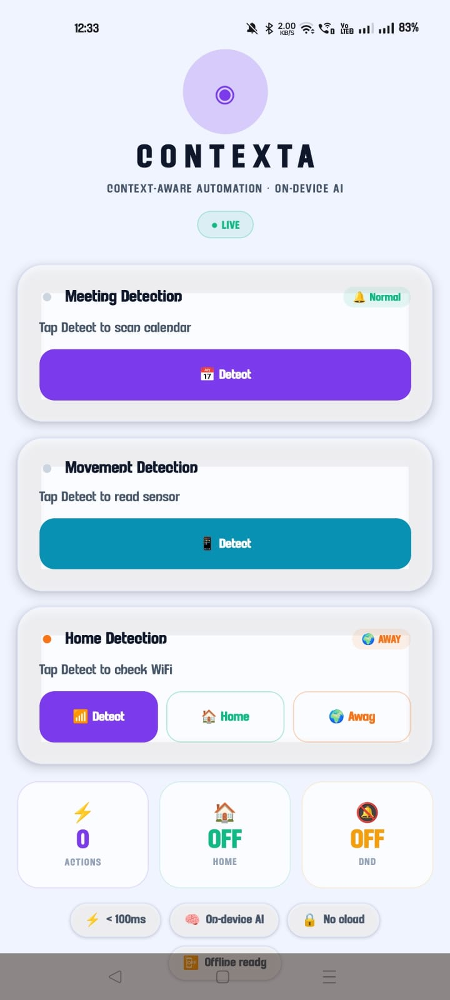
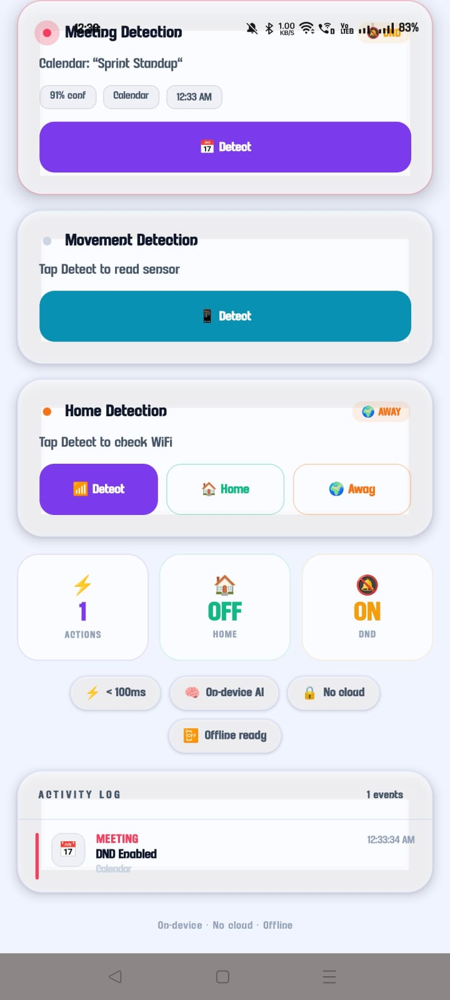
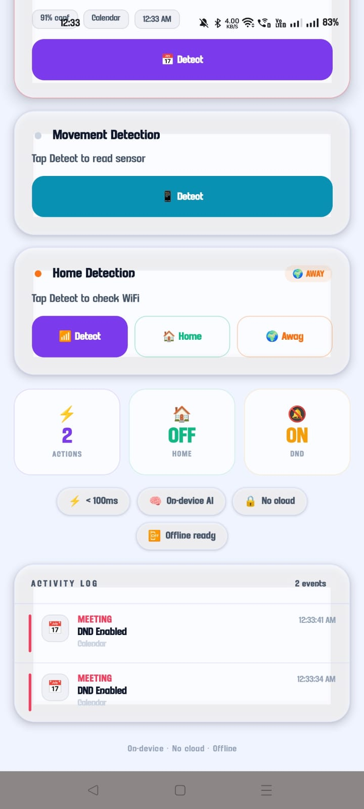
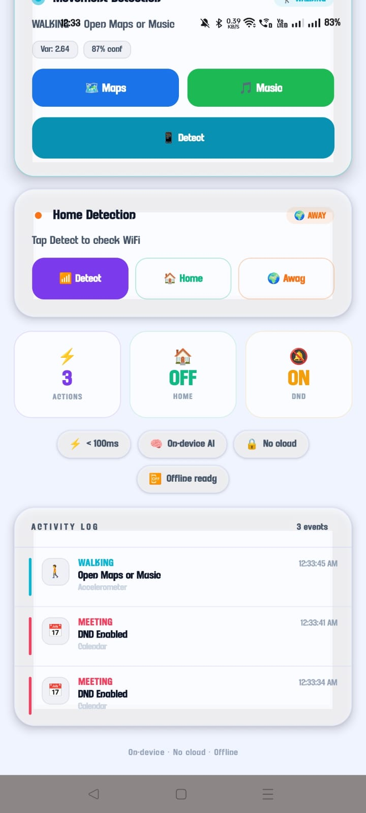
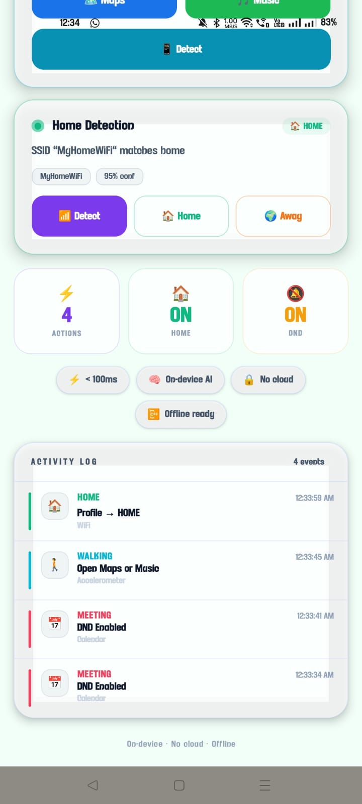
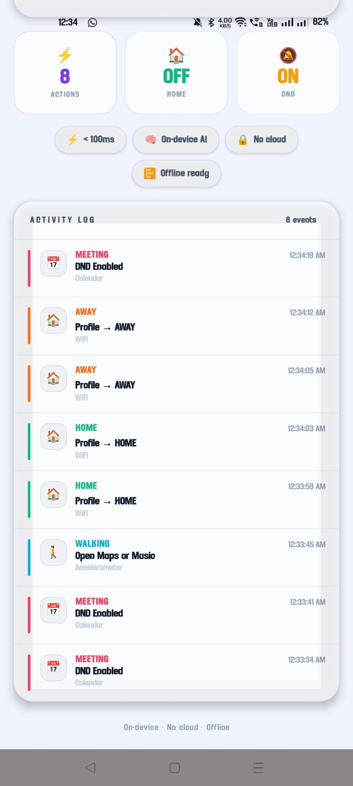
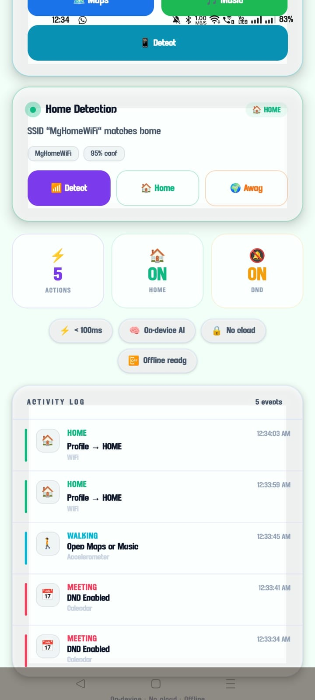
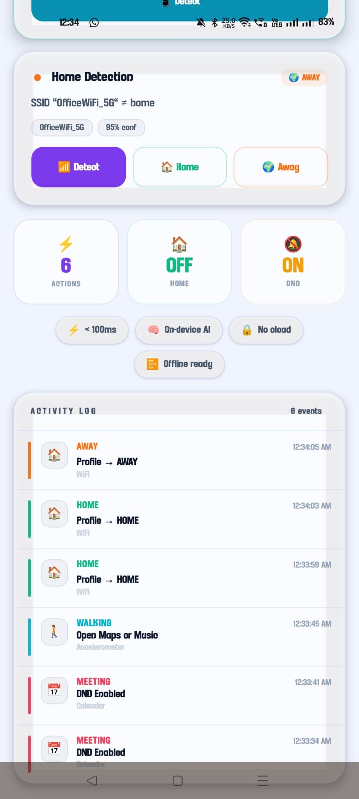

<div align="center">


# CONTEXTA

### Context-Aware Phone Intelligence · On-Device AI

> **Your phone already has everything it needs to help you. Contexta makes it act on it — on-device, privately, without asking.**

[](https://android.com)
[](https://reactnative.dev)
[](https://spring.io/projects/spring-boot)
[](https://www.samsungprism.com)
[](LICENSE)

[📲 Download APK](Contexta-Release.apk) · [🎬 Watch Demo](Contexta_Demo.mp4) · [📄 Full Proposal](Contexta_Openclaw.pdf)

</div>

---

## 📖 Table of Contents

- [Overview](#-overview)
- [The Problem](#️-the-problem)
- [The Solution](#-the-solution)
- [Screenshots](#-screenshots)
- [System Architecture](#️-system-architecture)
- [Intelligent Context Pipelines](#-intelligent-context-pipelines)
- [Tech Stack](#-tech-stack)
- [Project Structure](#-project-structure)
- [Privacy & Performance](#️-privacy--performance)
- [Getting Started](#-getting-started)
- [Team](#-team)

---

## 🌟 Overview

**Contexta** is a Personal AI Operating System layer for Android smartphones. It acts as an autonomous agent that continuously reads your physical environment and digital schedule to proactively adjust your phone settings — saving you from the cognitive tax of constant manual toggles.

Whether you're stepping into a meeting, walking to a destination, or arriving home after work, Contexta **observes**, **decides**, and **acts** seamlessly in the background — with zero cloud dependency, zero latency, and zero compromise on privacy.

| Stat | Value |
|------|-------|
| ⚡ Action Latency | < 100ms |
| 🧠 Processing | 100% On-Device |
| ☁️ Cloud Calls | Zero |
| 🔋 Battery Overhead | Negligible (WorkManager) |
| 📱 Platform | Android 10+ |

---

## ⚠️ The Problem

Smartphones are inherently **reactive**. This creates friction at every step of a user's day:

- **Manual Switching** — Users must remember to silence their phones before meetings or raise brightness when stepping outdoors.
- **Micro-Distractions** — The average user makes ~40 minor setting adjustments per day. Collectively, this fragments focus and wastes cognitive energy.
- **Rigid Schedules** — Tools like "Do Not Disturb" operate on fixed time windows, ignoring sudden real-world changes like an unexpected call or a walk.
- **Context Blindness** — No native Android feature connects your calendar, your movement, and your location into a unified, proactive response.

---

## 💡 The Solution

Contexta introduces a continuous, on-device perception-action loop:

```
┌──────────┐     ┌──────────┐     ┌──────────┐     ┌──────────┐
│  OBSERVE │────▶│  DECIDE  │────▶│   ACT    │────▶│  LEARN   │
│ Sensors  │     │ On-Device│     │ Settings │     │ Overrides│
│ Calendar │     │   ML/    │     │  DND /   │     │ Feedback │
│ WiFi/    │     │  Logic   │     │  Volume/ │     │  Loop    │
│ Accel.   │     │          │     │  Apps    │     │          │
└──────────┘     └──────────┘     └──────────┘     └──────────┘
```

1. **Observe** — Ingests native Android signals: Calendar events, Accelerometer readings, WiFi SSID.
2. **Decide** — Classifies user context in real-time using on-device logic (Meeting, Walking, Driving, Home, Away).
3. **Act** — Triggers system intents: DND mode, sound profiles, app launches.
4. **Learn** — Adapts instantly to user overrides without retraining or cloud sync.

---

## 📱 Screenshots

### 1. Initial Dashboard — Cold Start

The Contexta Intelligence Dashboard at startup. Three detectors (Meeting, Movement, Home) are idle, awaiting the first detection cycle.



---

### 2. Meeting Detection — DND Triggered

The Calendar detector identifies an upcoming "Sprint Standup" event with 91% confidence. DND is instantly enabled via Android's NotificationManager API.



---

### 3. Walking Detection — Maps & Music Launched

The Accelerometer computes XYZ variance > 0.8, classifying the user as walking (87% confidence). Contexta proactively opens Maps and Music in one tap.



---

### 4. Home Detection — HOME Profile Applied

WiFi SSID "MyHomeWiFi" matches the configured home network with 95% confidence. The Home Profile is applied: volumes normalized, app restrictions lifted.



---

### 5. Away Mode — Office WiFi Detected

WiFi SSID "OfficeWiFi_5G" does not match home. The device correctly stays in Away mode, keeping Office-appropriate settings active.



---

### 6. Activity Log — Full Event Timeline

The real-time Activity Audit Log showing all 8 autonomous decisions made in a single session: 2× DND triggers (Calendar), 1× Walking → Maps/Music, 2× Profile→HOME, 2× Profile→AWAY.



---

### 7. Home Profile Active State

HOME mode confirmed ON, DND still ON from an earlier meeting event. 5 actions have been taken in this session with the full pipeline running live.



---

### 8. Meeting Detection — Repeated Trigger

Calendar continuously re-scans the ±30-minute window. Multiple "DND Enabled" events confirm consistent responsiveness as calendar state is re-evaluated.



---

## 🏗️ System Architecture

Contexta's architecture bridges a high-fidelity React Native frontend with a powerful, low-latency Android Java Native Engine.

```
┌──────────────────────────────────────────────────────────────────────┐
│         REACT NATIVE FRONTEND  (Expo · TypeScript · UI/UX)           │
│                                                                      │
│   ContextDashboard   ActivityLog   OverridePanel   DetectorCards     │
├──────────────────┬───────────────────┬───────────────────────────────┤
│  CalendarBridge  │   MovementBridge  │        HomeBridge             │
│  (JSI / RN NM)   │   (JSI / RN NM)  │       (JSI / RN NM)           │
├──────────────────┴───────────────────┴───────────────────────────────┤
│          ANDROID NATIVE SENSOR FUSION ENGINE  (Java)                 │
│                                                                      │
│  ┌──────────────────┐  ┌──────────────────┐  ┌──────────────────┐   │
│  │  MeetingDetector │  │ MovementDetector │  │   HomeDetector   │   │
│  │  CalendarContract│  │  SensorManager   │  │   WifiManager    │   │
│  │  ±30min scan     │  │  XYZ variance    │  │   SSID match     │   │
│  └────────┬─────────┘  └────────┬─────────┘  └────────┬─────────┘   │
│           │                     │                      │             │
│  ┌────────▼─────────┐  ┌────────▼─────────┐  ┌────────▼─────────┐   │
│  │ MeetingModeCtrl  │  │ MovementAction   │  │ HomeProfileCtrl  │   │
│  │ DND / Silent API │  │ Maps · Music     │  │ Volume · Media   │   │
│  └──────────────────┘  └──────────────────┘  └──────────────────┘   │
│                                                                      │
│  ╔══════════════════════════════════════════════════════════════╗    │
│  ║            WorkManager  (battery-efficient polling)          ║    │
│  ╚══════════════════════════════════════════════════════════════╝    │
└──────────────────────────────────────────────────────────────────────┘
```

### Layer Breakdown

| Layer | Technology | Responsibility |
|-------|-----------|----------------|
| **UI Layer** | React Native 0.73, Expo, TypeScript | Dashboard, real-time logs, override controls |
| **Bridge Layer** | React Native Native Modules (JSI) | Bi-directional JSON sync between JS and Java |
| **Detector Layer** | Android Java | Reads raw sensors; outputs classified context |
| **Action Layer** | Android Intents & APIs | Executes system-level changes (DND, volume, app launch) |
| **Scheduler** | Android WorkManager | Battery-safe background polling; avoids aggressive Wakelocks |
| **Backend** | Spring Boot 3 | Rule configuration, telemetry storage, future ML model serving |

---

## 🧠 Intelligent Context Pipelines

### Pipeline 1 · Meeting Context (Calendar NLP)

```
CalendarContract ──▶ ±30min window scan ──▶ Keyword match
                                              (Meeting / Call / Standup)
                                                    │
                                                    ▼
                                   ACTION_INTERRUPTION_FILTER_PRIORITY
                                   (DND ON · Ringer Silenced)
```

- **Sensor:** Android `CalendarContract` provider
- **Window:** ±30 minutes from current time
- **Keywords:** `Meeting`, `Call`, `Standup`, `Interview`, `Review`
- **Confidence:** Reported as percentage match (e.g., 91%)
- **Action:** `NotificationManager.ACTION_INTERRUPTION_FILTER_PRIORITY` + silent ringer

---

### Pipeline 2 · Kinetic Context (Accelerometer Math)

```
SensorManager (SENSOR_DELAY_NORMAL)
        │
        ▼
XYZ magnitude vector ──▶ Sliding variance window
                                │
               ┌────────────────┴───────────────┐
          var > 3.0                         var > 0.8
               │                                │
               ▼                                ▼
           DRIVING                          WALKING
       Launch Google Maps              Launch Music App
```

- **Sensor:** `SensorManager.SENSOR_DELAY_NORMAL` (TYPE_ACCELEROMETER)
- **Math:** `variance = Σ(|magnitude - mean|²) / n`  over a sliding window
- **Thresholds:** Variance > 3.0 → Driving · Variance > 0.8 → Walking
- **Confidence:** Reported as percentage (e.g., 87%)
- **Action:** Fires Android `Intent` to launch Maps (Driving) or Spotify/Music (Walking)

---

### Pipeline 3 · Location Context (WiFi Geofencing)

```
WifiManager.getConnectionInfo()
        │
        ▼
Current SSID ──▶ Compare with stored Home SSID
                        │
          ┌─────────────┴──────────────┐
       MATCH                        NO MATCH
          │                            │
          ▼                            ▼
    Profile → HOME               Profile → AWAY
 (normalize volumes,          (office-appropriate
  lift app restrictions)         settings retained)
```

- **Sensor:** `WifiManager.getConnectionInfo()` (no GPS required)
- **Logic:** String-matches current SSID against user-configured home network
- **Confidence:** Fixed 95% (based on SSID uniqueness assumption)
- **Home Action:** Normalizes ringer volume, lifts notification restrictions, applies comfort media settings
- **Away Action:** Retains DND-compatible office profile; conserves battery

---

## 🛠 Tech Stack

| Area | Technology |
|------|-----------|
| Mobile Frontend | React Native 0.73, Expo, TypeScript |
| UI Design | Custom Glassmorphism · Tailwind-style utilities |
| Native Engine | Android Java (API 29+) |
| Background Jobs | Android WorkManager |
| Sensor APIs | CalendarContract, SensorManager, WifiManager |
| System APIs | NotificationManager, AudioManager, Intent |
| Backend | Spring Boot 3, Java 17 |
| Build | Gradle 8, EAS Build |

---

## 📁 Project Structure

```
Contexta/
├── android/                    # Android native module (Java)
│   └── app/src/main/java/
│       ├── detectors/
│       │   ├── MeetingDetector.java
│       │   ├── MovementDetector.java
│       │   └── HomeDetector.java
│       ├── controllers/
│       │   ├── MeetingModeController.java
│       │   ├── MovementActionController.java
│       │   └── HomeProfileController.java
│       └── bridges/
│           ├── CalendarBridge.java
│           ├── MovementBridge.java
│           └── HomeBridge.java
├── frontend/                   # React Native / Expo app (TypeScript)
│   ├── components/
│   │   ├── ContextDashboard.tsx
│   │   ├── DetectorCard.tsx
│   │   ├── ActivityLog.tsx
│   │   └── OverridePanel.tsx
│   └── services/
│       ├── CalendarService.ts
│       ├── MovementService.ts
│       └── HomeService.ts
├── backend/                    # Spring Boot 3 (Java)
│   └── src/main/java/
│       ├── config/
│       ├── controller/
│       └── service/
├── assets/
│   └── screenshots/            # App screenshots
├── docs/                       # Architecture diagrams
├── Contexta-Release.apk        # Prebuilt release APK
├── Contexta_Demo.mp4           # Demo walkthrough
├── Contexta_Openclaw.pdf       # Full hackathon proposal
└── README.md
```

---

## 🛡️ Privacy & Performance

| Principle | Implementation |
|-----------|---------------|
| **Zero Cloud Processing** | All detection logic runs 100% on-device. No calendar events, GPS data, or sensor telemetry ever leave the device. |
| **No Persistent Storage** | Sensor readings are processed in-memory and discarded immediately after classification. |
| **Negligible Battery Impact** | Uses Android WorkManager with batched tasks and passive listeners, avoiding aggressive CPU Wakelocks. |
| **Sub-100ms Latency** | Native Java execution eliminates JS-bridge round-trips for time-critical actions. |
| **Offline Ready** | Works without any internet connection. All intelligence is pre-compiled on the device. |

---

## 🚀 Getting Started

### Prerequisites

- Node.js 18+
- Android Studio (Flamingo or later)
- Java 17
- Expo CLI: `npm install -g expo-cli`

### Run the Frontend

```bash
git clone https://github.com/AnanthAkshay/Contexta.git
cd Contexta/frontend
npm install
npx expo run:android
```

### Build the Native Android Module

```bash
cd Contexta/android
./gradlew assembleRelease
```

### Run the Backend

```bash
cd Contexta/backend
./mvnw spring-boot:run
```

### Install the Prebuilt APK

```bash
adb install Contexta-Release.apk
```

> Grant permissions on first launch: **Calendar**, **Physical Activity**, and **Location (for WiFi SSID access)**.

---

## 👨‍💻 Team

**Team Beta Onepiece — M.S. Ramaiah Institute of Technology, Bengaluru**

| Name | Role |
|------|------|
| Akshay A | Team Lead · Frontend (React Native) |
| Aaditya V | Backend (Spring Boot) |
| Tejas M | UI/UX Design |
| H M Pranav | Database & Integration |

> *Submitted for the **OpenClaw Hackathon by Samsung Prism 2026** — Daily Utility Track.*

---

<div align="center">

Made with ❤️ in Bengaluru · M.S. Ramaiah Institute of Technology

⚡ On-device · 🧠 No cloud · 📴 Offline ready

</div>
