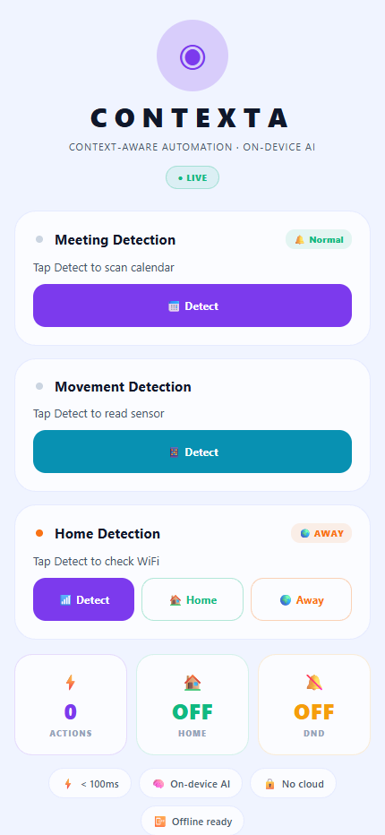
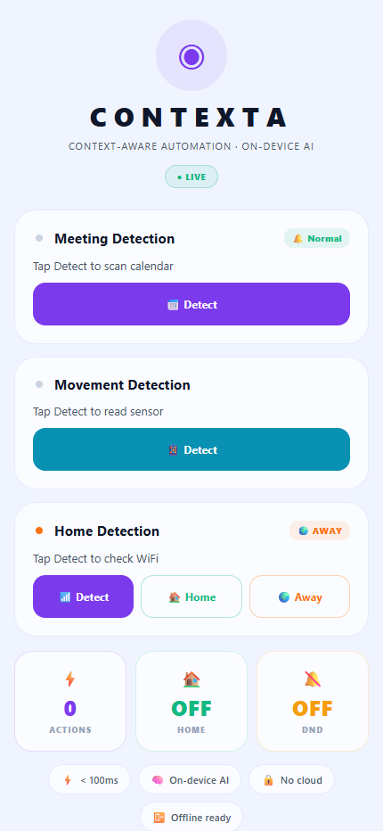

# Contexta — Context-Aware Phone Intelligence

> **Your phone already has everything it needs to help you. Contexta makes it act on it — on-device, privately, without asking.**

<p align="center">
  
</p>

<p align="center">
  
  
  
  
  
  
</p>

---

## Table of Contents

- [Overview](#overview)
- [Problem](#problem)
- [Solution](#solution)
- [Screenshots](#screenshots)
- [Core Concept](#core-concept)
- [System Architecture](#system-architecture)
- [Tech Stack](#tech-stack)
- [Features](#features)
- [Decision Pipeline](#decision-pipeline)
- [Implementation Status](#implementation-status)
- [Engineering Tradeoffs](#engineering-tradeoffs)
- [Future Scope](#future-scope)
- [Team](#team)

---

## Overview

**Contexta** is a Personal AI Operating System for Android smartphones. It reads your environment, learns your habits, and adjusts your phone settings — before you think to do it.

Built for students and professionals with structured daily routines. High-value scenarios: meetings, classes, commuting.

| Metric | Value |
|---|---|
| Fewer taps/day (estimated) | ~40 |
| Classifier latency | <5ms |
| Raw data leaving device | Zero |
| Android addressable market | 3.6B devices |

---

## Problem

Smartphones are **reactive by design**. This means:

- **Static defaults don't fit dynamic lives** — ringtones, brightness, and app layouts stay fixed regardless of where you are or what you're doing.
- **Context switching is manual and forgettable** — users must remember to enable Do Not Disturb before every meeting, adjust settings at every location change.
- **~40 setting adjustments per user per day** — each one is low-stakes individually. Collectively, they fragment focus and cost minutes throughout the day.

> *The phone has all the data it needs to be proactive. It just doesn't use it.*

### Why existing tools fall short

| Tool | What It Does | Critical Gap |
|---|---|---|
| Do Not Disturb | Silences on a fixed schedule | No context awareness at all |
| IFTTT / Tasker | Rule-based trigger → action | Breaks on edge cases; requires setup |
| Google Assistant | Responds to voice commands | Passive — you still initiate |
| Android Focus Modes | Manual profile switching | User must remember to switch |
| Pixel Call Screening | Single-purpose AI feature | Narrow; no general context model |
| **Contexta ★** | **Infers context; acts proactively** | **Gap addressed ✓** |

---

## Solution

Contexta runs a continuous **Observe → Decide → Act** loop, entirely on-device:

- **Reads signals** — location, calendar, time, recent app usage
- **Classifies context** — meeting, commute, sleep, leisure, focus
- **Dispatches actions** — silent mode, brightness, DND, app priority
- **Learns corrections** — user overrides feed back into the local model
- **Stays on-device** — no cloud inference; privacy-preserving by design

---

## Screenshots

> Add your screenshots to the `assets/screenshots/` folder and they will appear here.

<p align="center">
  
  &nbsp;&nbsp;
  
  &nbsp;&nbsp;
  
</p>

<p align="center">
  <em>Context Tab (live score card) &nbsp;·&nbsp; Signal Monitor (raw feed) &nbsp;·&nbsp; Audit Log (timestamped actions)</em>
</p>

<p align="center">
  
  &nbsp;&nbsp;
  
  &nbsp;&nbsp;
  
</p>

<p align="center">
  <em>Classifier Debug panel &nbsp;·&nbsp; Override Controls &nbsp;·&nbsp; Home Summary card</em>
</p>

---

## Core Concept

All three stages fire on a **30-second WorkManager polling cycle**. No user input required at any stage.

```
┌─────────────────────┐    ┌──────────────────────┐    ┌───────────────────────┐
│       OBSERVE        │    │        DECIDE         │    │      ACT + LEARN      │
│─────────────────────│    │──────────────────────│    │───────────────────────│
│ GPS + geofence       │───▶│ Context classifier   │───▶│ Android Settings API  │
│ Calendar / event NLP │    │   (TFLite)           │    │ Notification policy   │
│ Clock + day-of-week  │    │ Rule overlay         │    │ App surface adjust    │
│ App open/close delta │    │ Confidence threshold │    │ User override logged  │
│ Notification types   │    │ Action priority score│    │ Model update (local)  │
└─────────────────────┘    │ Conflict resolution  │    └───────────────────────┘
                            └──────────────────────┘
```

### A Real Day — 6 Context Transitions, 0 Manual Changes

| Time | Signal | Action Taken |
|---|---|---|
| 7:48 AM | Alarm dismissed · GPS at home | Morning mode: max brightness · news widget surfaced |
| 8:22 AM | GPS: moving, speed > 20 km/h | Maps launched proactively · podcast prioritised |
| 9:00 AM | Calendar: 'Sprint Standup' detected | Silent mode on · Slack muted · DND activated |
| 9:48 AM | Calendar event ended | Notifications restored · email sorted by priority |
| 1:05 PM | GPS: lunch location pattern recognised | Screen timeout extended · media apps surfaced |
| 6:40 PM | GPS: home geofence entered | Work profile paused · personal mode activated |

---

## System Architecture

```
┌──────────────────────────────────────────────────────────────────┐
│  UI LAYER       React Native App · Override Controls · Audit Log  │
├──────────────────────────────────────────────────────────────────┤
│  ORCHESTRATION  Spring Boot API · Action Dispatcher · Event Bus   │
├──────────────────────────────────────────────────────────────────┤
│  INTELLIGENCE   TFLite Classifier · Rule Engine · Feedback Proc.  │
├──────────────────────────────────────────────────────────────────┤
│  DATA LAYER     PostgreSQL 16 · SQLite (on-device) · Redis 7      │
├──────────────────────────────────────────────────────────────────┤
│  SENSOR/PLATFORM GPS API · Calendar Provider · WorkManager        │
└──────────────────────────────────────────────────────────────────┘
```

> TFLite runs fully on-device. Backend receives only context labels — never raw location or calendar data. System functions completely without backend dependency in offline mode.

---

## Tech Stack

### Mobile / Frontend
- **React Native 0.73** — Cross-platform UI
- **Expo SDK 50** — Dev + OTA updates
- **Redux Toolkit** — State management

### Backend Services
- **Java 17 + Spring Boot 3** — REST API server
- **Spring Security 6** — JWT auth
- **WebSocket (STOMP)** — Real-time push

### AI / ML
- **TensorFlow Lite 2.14** — On-device inference
- **Scikit-learn** — Offline training
- **Custom Pipeline** — Signal normalisation

### Data Layer
- **PostgreSQL 16** — Event + action log
- **SQLite (on-device)** — Local cache / offline
- **Redis 7** — Session + API cache

### Infra / Tooling
- **Android WorkManager** — Background scheduling
- **Fused Location API** — GPS / geofence
- **JUnit 5 + Mockito** — Test coverage

---

## Features

### Context Sensing
- Location geofencing (home / work / other)
- Calendar NLP: title keyword extraction
- Time + weekday pattern detection

### Adaptive Actions
- Silent / DND auto-toggle
- Brightness + screen timeout adjustment
- Notification channel suppression

### On-Device AI
- TFLite classifier: 50KB, <5ms latency
- Rule + ML hybrid for reliability
- Nightly incremental local retraining

### User Trust Layer
- One-tap override at any time
- Full audit log of every auto-action
- Per-context sensitivity slider

---

## Decision Pipeline

```
Raw Signals ──▶ Feature Vector ──▶ Context Label ──▶ Rule Check ──▶ Action Set ──▶ Executed
GPS·Cal·Clock   {loc,event,hour,  TFLite ≥ 0.72    Emergency?     Silent/Bright   Settings
                 day}              conf.             Override?      /DND            API called

        └─────────────── User Override → Feedback Loop → Logged to DB → Nightly Retraining ───────────────┘
```

### Confidence Threshold Logic

| Confidence Score | Behaviour |
|---|---|
| ≥ 0.80 | Action dispatched automatically |
| 0.55 – 0.79 | Action dispatched with silent review log |
| < 0.55 | Fallback to last known state; no action taken |

### Sample Classifier Log Output

```log
09:00:03.412 [WorkManager-1]
INFO  SignalCollector: GPS fix acquired
INFO  location_class=WORK (geofence hit)
INFO  CalendarParser: event=Sprint Standup
INFO  event_type=MEETING hour_bin=9

09:00:03.489 [TFLiteClassifier]
INFER context=MEETING conf=0.91
scores: {MTG:0.91 CMT:0.05 SLP:0.02 FOC:0.01 LSR:0.01}

09:00:03.501 [ActionDispatcher]
ACTION RINGER_MODE -> SILENT [OK]
ACTION DND_POLICY -> PRIORITY [OK]

09:00:03.512 [AuditLogger]
DB WRITE action_log id=1482 [201 OK]
override_flag=false latency=89ms
```

---

## Implementation Status

### ✅ Built
- **Context classifier (TFLite)** — 3-layer MLP on 2,000 synthetic + 500 real behavioural samples
- **Location geofencing** — Android Fused Location API, home / work / other 3-class
- **Calendar NLP keyword parser** — Regex + keyword list for meeting/event detection (no LLM)
- **Silent mode + DND dispatch** — Tested on Pixel 7 emulator; Settings API integration confirmed
- **Spring Boot REST API** — CRUD: context_log, action_log, override_capture endpoints
- **PostgreSQL schema + ORM** — Hibernate entities: context_events, action_log, user_corrections

### 🟡 In Progress
- **Brightness adaptive control** — Logic written; permission prompt flow incomplete on physical device
- **App surface re-ranking** — Algorithm designed; Android Launcher API integration 70% done
- **Incremental retraining** — Batch script runs; not yet wired into WorkManager schedule

### 📋 Planned
- **Cross-device sync** — Architecture sketched; needs Google Identity + device link layer
- **Per-user model personalisation** — Federated averaging approach identified; not yet implemented
- **OEM / system-level hooks** — Requires signed OEM agreement; out of hackathon scope

---

## Engineering Tradeoffs

### Battery & Background Restrictions
- **Problem:** Android Doze mode kills background services after ~10 min inactivity.
- **Fix:** WorkManager with periodic tasks (min 15-min interval). Accepting some latency tradeoff.

### Android Permission Wall
- **Problem:** `WRITE_SETTINGS`, `ACCESS_BACKGROUND_LOCATION`, `PACKAGE_USAGE_STATS` all require explicit grants; some need OEM permissions.
- **Fix:** Onboarding requests permissions one-at-a-time with justification. Degraded mode if denied.

### Privacy & Data Minimisation
- **Problem:** Location + calendar data is sensitive. Sending raw signals to a server is a hard no for most users.
- **Fix:** All inference on-device via TFLite. Backend receives only context labels — never raw location or calendar data.

### Model Accuracy vs. Action Cost
- **Problem:** A misclassification that silences calls during an emergency is worse than doing nothing.
- **Fix:** 0.55 confidence floor. Emergency contacts always bypass DND. Overrides log negative reward signal.

---

## Future Scope

| Timeline | Goals |
|---|---|
| Short term (1 month) | Physical device testing on 3+ Android models · Brightness + app ranking fully wired · Delta fine-tuning |
| Medium term (3 months) | Open beta: 50 real users · Privacy audit vs GDPR / India DPDP · Android 14 restricted settings compat |
| Long term | OEM partnership for system integration · Cross-device sync · Accessibility adaptive mode |

---

## Team

**Team Beta Onepiece — M.S. Ramaiah Institute of Technology, Bengaluru**

| Name | Roll No. | Role |
|---|---|---|
| Akshay A | 1MS24IS013 | Team Lead · Frontend |
| Aaditya V | 1MS24IS001 | Backend |
| Tejas M | 1MS24CI134 | UI/UX |
| H M Pranav | 1MS24IS047 | Database |

---

> *Submitted for OpenClaw Hackathon by Samsung Prism 2026 — Daily Utility Track*
